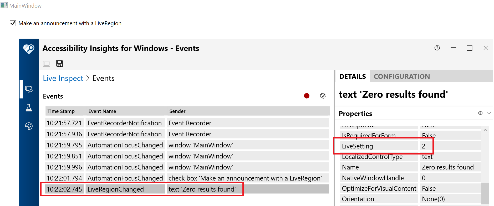

# WPF_NarratorAnnouncements

In .NET Framework 4.7.1 and later, WPF supports LiveRegions, which when used wisely can really, really help your customers. It means that when something important's happened in your app and it's happened at some point away from where your customer is currently working, and your customers must be made aware of what's happened, then you can support your customers who use screen readers.

When searching for details on how to use LiveRegions in a WPF app, watch out that you don't end up at the UWP XAML page. Here's the WPF page, [AutomationProperties.LiveSetting](https://docs.microsoft.com/en-us/dotnet/api/system.windows.automation.automationproperties.livesetting?view=netframework-4.8#System_Windows_Automation_AutomationProperties_LiveSetting).

And here are some of my own musings which are somewhat related, [Common approaches for enhancing the programmatic accessibility of your Win32, WinForms and WPF apps](https://www.linkedin.com/pulse/common-approaches-enhancing-programmatic-your-win32-winforms-barker/). And if you want the best general introduction into UIA, which is also a critical part in all this, here's [UI Automation: An Incomplete Guide for UI builders](https://www.linkedin.com/pulse/ui-automation-incomplete-guide-builders-part-1-guy-barker/).

This tiny WPF_NarratorAnnouncements app came about following a request for a sample which showed how to trigger a Narrator announcement following some action in a WPF app. In the scenario of interest, it did seem helpful to the customer to have an announcement made. Basically, a checkbox would be checked, a search would be done in response, and a list shown somewhere else in the window would be populated with the results. The desired announcement would be the number of results that are available. My snippet up at [WPF: A screen reader isn't announcing an update to a status string or error string](https://docs.microsoft.com/en-us/accessibility-tools-docs/items/WPF/Text_LiveSetting) shows how to do that for a TextBlock shown visually, but in the scenario of interest here, there's no visual TextBlock showing the count of results. The next step would be to consider whether a visual text label should be shown, but that wasn't the design here. So the sample app uses a TextBlock that's not shown visually on the screen. Personally, I'd not make the TextBlock not-Visible, and while that might seem to work in some cases with .NET Framework 4.7.1 and 4.7.2, it may be less likely to work with a screen reader when built for .NET Framework 4.8. So I'd make the TextBlock either offscreen or zero-size.

And like the code says, do consider whether it's ok for the text announced to be reached by the customer later when navigating around the UI. If the text could become stale and misleading, make sure to clear it after it's been announced.

The image below show the Accessibility Insights for Windows tool reporting that a UIA LiveRegionChanged event is raised from a WPF TextBlock, and that the UIA LiveSetting property of Assertive, (a value of 2).

